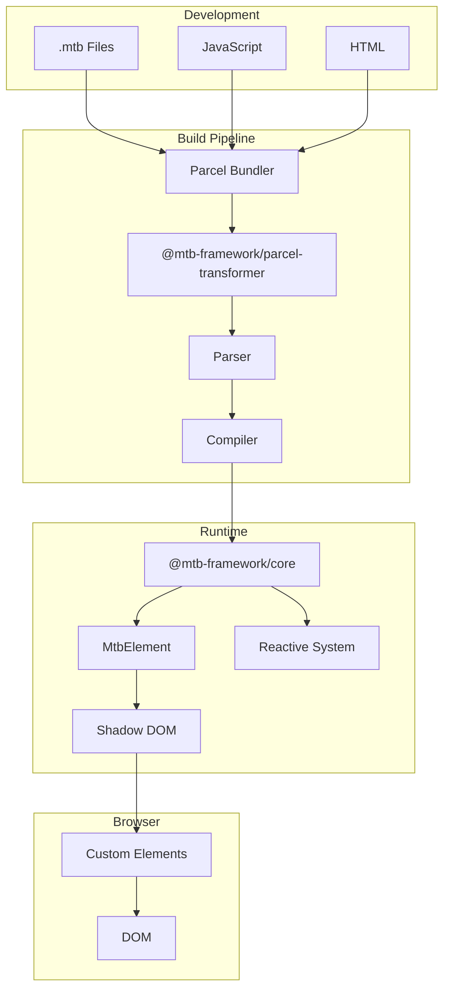
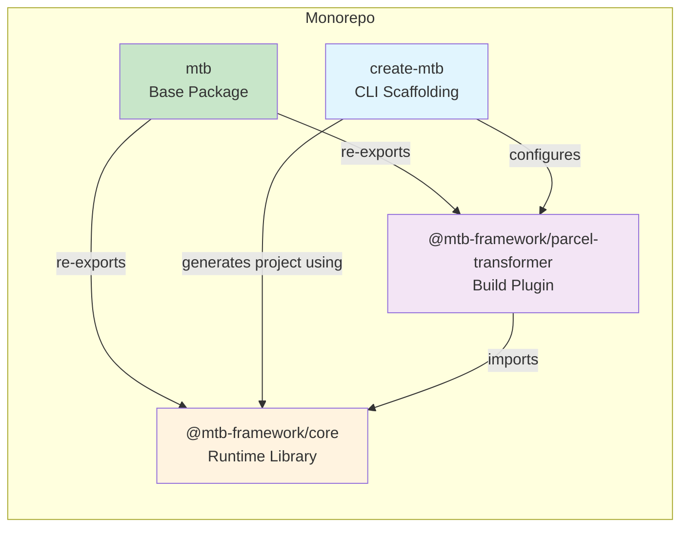
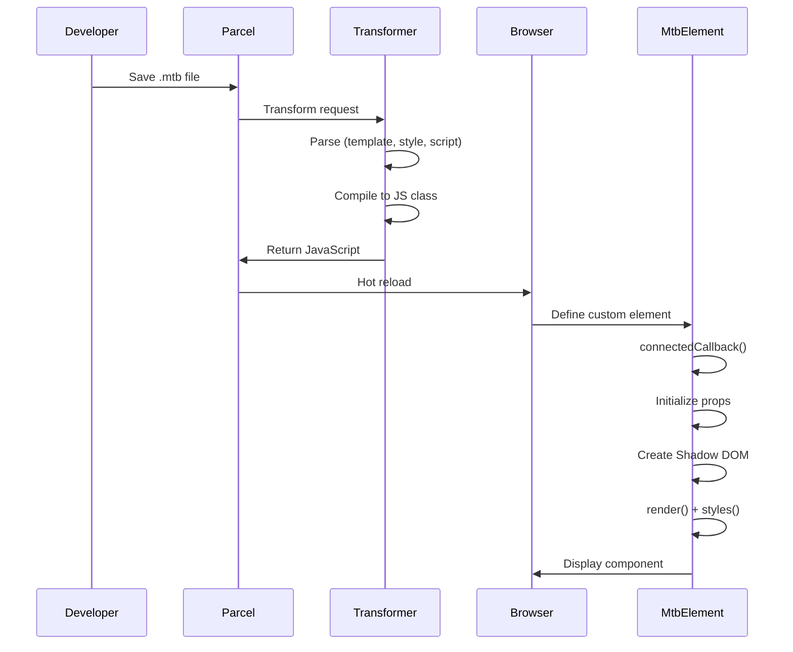
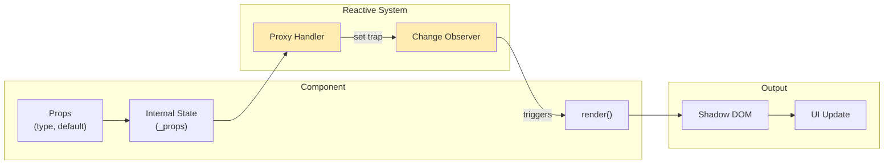

# mtb - Web Components Framework 🚀

[](https://badge.fury.io/js/@mtb-framework%2Fcore)
[](https://opensource.org/licenses/MIT)

A lightweight Web Components framework with Parcel integration. Create reactive custom elements using a simple single-file component syntax.

## ✨ Features

- 🧩 **Single-File Components** - Write template, style, and script in one `.mtb` file
- ⚡ **Reactive Properties** - Automatic re-rendering when properties change
- 🎨 **Scoped Styles** - Shadow DOM encapsulation for isolated styles
- 🔌 **Parcel Integration** - Zero-config build with hot module replacement
- 📦 **Lightweight** - No heavy runtime dependencies
- 🛠️ **Easy Scaffolding** - Create new projects with `npm create mtb`

## 🚀 Quick Start

```bash
# Create a new project
npm create mtb my-app

# Navigate and install
cd my-app
npm install

# Start development server
npm start
```

## 📄 Supported File Extensions

mtb supports multiple file extensions for single-file components:

| Extension | Description | IDE Support |
|-----------|-------------|-------------|
| `*.mtb` | Original mtb extension | Requires custom plugin |
| `*.component.html` | Angular-style naming | Native HTML support |
| `*.mtb.html` | mtb-branded HTML | Native HTML support |

**Recommendation**: Use `*.component.html` or `*.mtb.html` for better IDE support including automatic syntax highlighting, IntelliSense, and formatting.

## 💻 Component Syntax

Create component files with template, style, and script sections. You can use any of the supported extensions (`.mtb`, `.component.html`, or `.mtb.html`):

```html
<!-- src/components/my-button.component.html (or my-button.mtb.html or my-button.mtb) -->
<template>
  <button class="btn btn-${variant}" @click="handleClick">
    <slot></slot>
  </button>
</template>

<style>
  .btn {
    padding: 0.5rem 1rem;
    border: none;
    border-radius: 4px;
    cursor: pointer;
  }
  .btn-primary {
    background: #3498db;
    color: white;
  }
  .btn-secondary {
    background: #95a5a6;
    color: white;
  }
</style>

<script>
  export default {
    props: {
      variant: { type: String, default: "primary" },
    },
    methods: {
      handleClick(e) {
        this.emit("click", e);
      },
    },
  };
</script>
```

## 📁 Project Structure

```
my-app/
├── src/
│   ├── components/
│   │   ├── mtb-button.component.html  (or .mtb.html or .mtb)
│   │   ├── mtb-card.component.html
│   │   └── mtb-header.component.html
│   ├── index.js
│   └── index.html
├── .parcelrc
└── package.json
```

## ⚙️ Configuration

### .parcelrc

```json
{
  "extends": "@parcel/config-default",
  "transformers": {
    "*.mtb": ["@mtb-framework/parcel-transformer"],
    "*.component.html": ["@mtb-framework/parcel-transformer"],
    "*.mtb.html": ["@mtb-framework/parcel-transformer"]
  }
}
```

### Using Components

Import component files in your JavaScript (all extensions are supported):

```javascript
// src/index.js

// New recommended formats (better IDE support)
import "./components/mtb-header.component.html";
import "./components/mtb-button.component.html";
import "./components/mtb-card.component.html";

// Alternative mtb-branded format
import "./components/mtb-header.mtb.html";

// Original format (still fully supported)
import "./components/mtb-header.mtb";
```

Use in HTML:

```html
<mtb-header title="My App"></mtb-header>
<mtb-button variant="primary">Click me</mtb-button>
<mtb-card title="Hello">
  <p>Content goes here</p>
</mtb-card>
```

## 📚 API Reference

### MtbElement

Base class for creating Web Components.

```javascript
// Recommended: import from the mtb base package
import { MtbElement, defineComponent } from "mtb";

// Alternative: import from subpath
import { MtbElement, defineComponent } from "mtb/core";

// Or directly from the core package
import { MtbElement, defineComponent } from "@mtb-framework/core";

class MyComponent extends MtbElement {
  static properties = {
    name: { type: String, default: "World" },
  };

  render() {
    return `<p>Hello, ${this._props.name}!</p>`;
  }

  styles() {
    return `p { color: blue; }`;
  }
}

defineComponent("my-component", MyComponent);
```

### Reactive State

```javascript
// Recommended: import from the mtb base package
import { reactive, createStore } from "mtb";

// Local reactive state
const state = reactive({ count: 0 }, () => console.log("Changed!"));
state.count++;

// Shared store
const store = createStore({ theme: "light" });
store.subscribe((prop, val) => console.log(`${prop} = ${val}`));
store.state.theme = "dark";
```

## 📦 Packages

| Package                                                                | Description                                      |
| ---------------------------------------------------------------------- | ------------------------------------------------ |
| [mtb](./packages/mtb)                                                  | Base package (recommended for most users)        |
| [@mtb-framework/core](./packages/core)                                 | Core runtime for Web Components                  |
| [@mtb-framework/parcel-transformer](./packages/parcel-transformer-mtb) | Parcel transformer for .mtb files                |
| [create-mtb](./packages/create-mtb)                                    | CLI for project scaffolding                      |

### Import Options

The `mtb` base package provides a simplified way to import the framework:

```javascript
// ✅ Recommended: Import from mtb (re-exports @mtb-framework/core)
import { MtbElement, defineComponent, reactive, createStore } from "mtb";

// Alternative: Use subpath exports for explicit imports
import { MtbElement, defineComponent } from "mtb/core";
import transformer from "mtb/parcel-transformer";

// Direct package imports (still supported)
import { MtbElement } from "@mtb-framework/core";
import transformer from "@mtb-framework/parcel-transformer";
```

**Recommendation**: Use `import from "mtb"` for simplicity. The subpath exports (`mtb/core`, `mtb/parcel-transformer`) are available when you need explicit control over which subpackage you're importing from.

## 🤝 Contributing

Contributions are welcome! Please feel free to submit a Pull Request.

1. Fork the repository
2. Create your feature branch (`git checkout -b feature/amazing-feature`)
3. Commit your changes (`git commit -m 'Add amazing feature'`)
4. Push to the branch (`git push origin feature/amazing-feature`)
5. Open a Pull Request

## 📄 License

This project is licensed under the MIT License - see the [LICENSE](LICENSE) file for details.

## 👤 Author

**Diego Vallejo**

- GitHub: [@DiegoVallejoDev](https://github.com/DiegoVallejoDev)

---

## 🔬 Technical Deep Dive

<details>
<summary><strong>🏗️ Architecture Overview</strong></summary>



</details>

<details>
<summary><strong>📦 Package Structure</strong></summary>



</details>

<details>
<summary><strong>🔄 Component Lifecycle</strong></summary>



</details>

<details>
<summary><strong>⚡ Reactive Data Flow</strong></summary>



</details>

<details>
<summary><strong>🔄 Migration from v0.x</strong></summary>

mtb v1.0.0 is a complete rewrite focused on Web Components. If you're migrating from v0.x:

1. **New Architecture** - v1.0.0 uses Web Components instead of static HTML templates
2. **Different Syntax** - Components use `.mtb` single-file format instead of `.html`
3. **Parcel Integration** - Built as a Parcel transformer instead of standalone CLI
4. **No Backward Compatibility** - v1.0.0 is a breaking release

For legacy static site generation, continue using mtb v0.3.x.

</details>

---

**Happy building with mtb! 🎉**
