# mtb (Mountain Terrain Bike / All Terrain JS)

[](https://badge.fury.io/js/mtb)
[](https://opensource.org/licenses/MIT)

A lightweight JavaScript library for building static HTML applications with a consistent design and component-based structure. Perfect for creating static websites with reusable HTML components.

## 📋 Table of Contents

- [Features](#-features)
- [Installation](#-installation)
- [Quick Start](#-quick-start)
- [How It Works](#-how-it-works)
- [Directory Structure](#-directory-structure)
- [Usage](#-usage)
- [API Reference](#-api-reference)
- [Examples](#-examples)
- [Contributing](#-contributing)
- [License](#-license)

## ✨ Features

- 🧩 **Component-Based Architecture**: Create reusable HTML components
- 📁 **Simple File Structure**: Organized separation of components and pages
- 🚀 **Zero Configuration**: Works out of the box with sensible defaults
- 🔄 **Template Compilation**: Automatic component injection using `{{componentName}}` syntax
- 🎯 **Lightweight**: No heavy dependencies or complex build processes
- 🛠️ **CLI Tool**: Easy-to-use command-line interface

## 📦 Installation

### Global Installation (Recommended for CLI usage)

```bash
npm install -g mtb
```

### Local Installation (For programmatic usage)

```bash
npm install mtb
```

## 🚀 Quick Start

1. **Create your project structure:**

```bash
mkdir my-website
cd my-website
mkdir -p src/components src/pages public
```

2. **Create a component** (`src/components/header.html`):

```html
<header>
  <h1>My Awesome Website</h1>
  <nav>
    <a href="/">Home</a>
    <a href="/about.html">About</a>
  </nav>
</header>
```

3. **Create a page** (`src/pages/index.html`):

```html
<!DOCTYPE html>
<html>
<head>
  <title>Home</title>
</head>
<body>
  {{header}}
  <main>
    <h2>Welcome!</h2>
    <p>This is my homepage.</p>
  </main>
</body>
</html>
```

4. **Build your pages:**

```bash
mtb
```

5. **Check the output** in `public/index.html` - your components will be automatically injected!

## 🔍 How It Works

mtb follows a simple compilation process:

```mermaid
flowchart TD
    A[Start mtb] --> B{Check Directories}
    B -->|Missing| C[Create src/components/<br/>and src/pages/]
    B -->|Exists| D[Scan Components]
    C --> D
    D --> E[Register Components<br/>in Memory]
    E --> F[Load Pages]
    F --> G[Compile Each Page]
    G --> H{Find {{component}}<br/>Tags}
    H -->|Found| I[Replace with<br/>Component HTML]
    I --> H
    H -->|None| J[Write to public/]
    J --> K[Next Page]
    K -->|More Pages| G
    K -->|Done| L[End]
```

### Component Compilation Process

```mermaid
sequenceDiagram
    participant User
    participant CLI
    participant FileSystem
    participant Compiler
    
    User->>CLI: Run 'mtb' command
    CLI->>FileSystem: Check for src/components/
    CLI->>FileSystem: Check for src/pages/
    CLI->>FileSystem: Read all component files
    FileSystem-->>CLI: Component HTML content
    CLI->>Compiler: Register components in memory
    CLI->>FileSystem: Read all page files
    FileSystem-->>CLI: Page HTML content
    
    loop For each page
        Compiler->>Compiler: Find {{componentName}} patterns
        Compiler->>Compiler: Replace with component HTML
        Compiler->>FileSystem: Write compiled HTML to public/
    end
    
    CLI-->>User: ✓ Done
```



## 📂 Directory Structure


### Directory Explanation

- **`src/components/`**: Store your reusable HTML components here
- **`src/pages/`**: Store your page templates that use components
- **`public/`**: Compiled HTML files are output here (ready for deployment)

## 💻 Usage

### CLI Usage

Simply run the command in your project directory:

```bash
mtb
```

Output:
```
┏ mtb.js v0.1
┠ Found : 3 components in src/components/
┠ preparing pages...
┠ Found : 2 pages in src/pages/
┠ Compiling pages...
┗ Done
```

### Programmatic Usage

You can also use mtb as a library in your Node.js applications:

```javascript
const mtb = require('mtb');

// Run the full compilation process
mtb.run();

// Or use individual functions
mtb.registerComponent('./src/components/mycomponent.html', 'mycomponent');
const component = mtb.getComponent('mycomponent');
const compiled = mtb.compileComponents('index');
```

## 📚 API Reference

### `run()`

Executes the complete compilation process:
1. Creates directories if they don't exist
2. Registers all components
3. Loads all pages
4. Compiles and outputs HTML files

```javascript
mtb.run();
```

### `registerComponent(path, name)`

Registers a component from a file path.

**Parameters:**
- `path` (string): Path to the component HTML file
- `name` (string, optional): Component name. If not provided, uses the filename

```javascript
mtb.registerComponent('./src/components/header.html', 'header');
```

### `getComponent(name)`

Retrieves a registered component's HTML content.

**Parameters:**
- `name` (string): Name of the component

**Returns:** (string) Component HTML content

```javascript
const headerHTML = mtb.getComponent('header');
```

### `getPage(name)`

Reads a page file from the pages directory.

**Parameters:**
- `name` (string): Page filename

**Returns:** (string) Page HTML content

```javascript
const indexPage = mtb.getPage('index.html');
```

### `compileComponents(page)`

Compiles a page by replacing component placeholders with actual component HTML.

**Parameters:**
- `page` (string): Page name (without extension)

**Returns:** (string) Compiled HTML content

```javascript
const compiled = mtb.compileComponents('index');
```

### `createPages()`

Compiles all registered pages and writes them to the output directory.

```javascript
mtb.createPages();
```

## 📖 Examples

### Example 1: Simple Blog Layout

**Component: `src/components/blog-header.html`**
```html
<header class="blog-header">
  <h1>My Dev Blog</h1>
  <p>Thoughts on code and technology</p>
</header>
```

**Component: `src/components/blog-post.html`**
```html
<article class="blog-post">
  <h2>Article Title</h2>
  <p class="date">January 1, 2024</p>
  <p>Article content goes here...</p>
</article>
```

**Page: `src/pages/blog.html`**
```html
<!DOCTYPE html>
<html>
<head>
  <title>My Blog</title>
  <link rel="stylesheet" href="styles.css">
</head>
<body>
  {{blog-header}}
  <main>
    {{blog-post}}
  </main>
</body>
</html>
```

### Example 2: Multiple Component Usage

Components can be used multiple times in the same page:

**Page: `src/pages/gallery.html`**
```html
<!DOCTYPE html>
<html>
<head>
  <title>Gallery</title>
</head>
<body>
  {{header}}
  {{image-card}}
  {{image-card}}
  {{image-card}}
  {{footer}}
</body>
</html>
```

### Example 3: Working with Alpine.js

mtb was designed to work seamlessly with Alpine.js:

**Component: `src/components/counter.html`**
```html
<div x-data="{ count: 0 }">
  <button @click="count++">Increment</button>
  <span x-text="count"></span>
</div>
```

**Page: `src/pages/app.html`**
```html
<!DOCTYPE html>
<html>
<head>
  <title>Interactive App</title>
  <script defer src="https://cdn.jsdelivr.net/npm/alpinejs@3.x.x/dist/cdn.min.js"></script>
</head>
<body>
  {{counter}}
</body>
</html>
```

## 🎯 Component Naming Convention

- Use lowercase filenames: `header.html`, `footer.html`
- Use hyphens for multi-word components: `blog-post.html`, `image-card.html`
- Reference components in pages using their filename (without extension): `{{blog-post}}`

## 🔧 Configuration

Currently, mtb uses these default directories (hardcoded):
- Components: `src/components/`
- Pages: `src/pages/`
- Output: `public/`

Future versions may include a configuration file for customization.

## 🤝 Contributing

Contributions are welcome! Please feel free to submit a Pull Request.

1. Fork the repository
2. Create your feature branch (`git checkout -b feature/AmazingFeature`)
3. Commit your changes (`git commit -m 'Add some AmazingFeature'`)
4. Push to the branch (`git push origin feature/AmazingFeature`)
5. Open a Pull Request

## 📄 License

This project is licensed under the MIT License - see the [LICENSE](LICENSE) file for details.

## 👤 Author

**Diego Vallejo**

- GitHub: [@DiegoVallejoDev](https://github.com/DiegoVallejoDev)

## 🙏 Acknowledgments

- Designed to work seamlessly with [Alpine.js](https://alpinejs.dev/)
- Inspired by the need for simple, static site generation with component reusability

## 📝 Notes

- Component files must be valid HTML
- Components are inserted as-is without any processing
- Nested component references (components within components) are not currently supported
- Page files should include the `.html` extension in the pages directory

---

**Happy building! 🚀**

